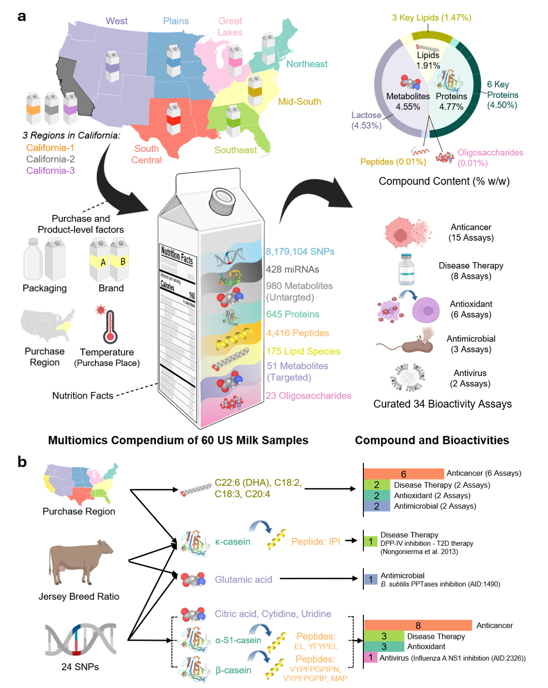

# Integrated omics reveals actionable drivers of bioactive variation in US milk

This repository contains data, analysis code, processed outputs, and figure assets for the DMI milk omics study.

## Database access

The database is available online at [dairymolecules.com](http://dairymolecules.com/). An account for browsing the data is available upon request.

## Study overview



## Directory overview

- `Code/`: analysis scripts organized by figure or supplemental figure groups.
- `Data/`: raw and reference datasets used by the analyses.
- `ProcessedData/`: intermediate and final processed tables generated by scripts.
- `Figures/`: exported figure files used in the manuscript.

## Software versions

- **R**: tested with **R 4.2.2**
- **Python**: tested with **Python 3.11**

## R package dependencies

The following R packages are imported by scripts under `/home/runner/work/DMI/DMI/Code`:

`Biostrings`, `ComplexHeatmap`, `MOFA2`, `PubChemR`, `RColorBrewer`, `RCurl`, `XML`, `basicdrm`, `car`, `circlize`, `colorspace`, `data.table`, `doParallel`, `dplyr`, `emmeans`, `fastcluster`, `foreach`, `ggplot2`, `ggraph`, `ggrastr`, `ggsankey`, `gsubfn`, `jsonlite`, `lavaan`, `lme4`, `mapdata`, `maps`, `nnls`, `patchwork`, `plotrix`, `scales`, `stringr`, `this.path`, `tidygraph`, `usmap`, `xml2`

Install from CRAN:

```r
install.packages(c(
  "PubChemR", "RColorBrewer", "RCurl", "XML",
  "basicdrm", "car", "circlize", "colorspace", "data.table", "doParallel",
  "dplyr", "emmeans", "fastcluster", "foreach", "ggplot2", "ggraph",
  "ggrastr", "ggsankey", "gsubfn", "jsonlite", "lavaan", "lme4", "mapdata",
  "maps", "nnls", "patchwork", "plotrix", "scales", "stringr", "this.path",
  "tidygraph", "usmap", "xml2"
))
```

Install Bioconductor packages:

```r
if (!requireNamespace("BiocManager", quietly = TRUE)) install.packages("BiocManager")
BiocManager::install(c("Biostrings", "MOFA2", "ComplexHeatmap"))
```

## Python package dependencies

The following third-party Python packages are imported by scripts under `/home/runner/work/DMI/DMI/Code`:

`matplotlib`, `numpy`, `pandas`, `scipy`, `scikit-learn`, `tqdm`

Only the following `Code` workflows currently contain Python scripts:

- `/home/runner/work/DMI/DMI/Code/SuppFig15_CompoundPCA`
- `/home/runner/work/DMI/DMI/Code/Fig5_SuppFig12_29_SNP_miRNA_CompoundCorr/Python_CorrelationEvaluation`

Install with pip:

```bash
pip install matplotlib numpy pandas scipy scikit-learn tqdm
```

## Regenerating figures and supplementary figures

To regenerate figures/supplementary figures, run the analysis scripts inside each subdirectory under `/home/runner/work/DMI/DMI/Code`.

- Each subdirectory corresponds to one figure or supplemental figure workflow.
- Some workflows are R-based and some include Python scripts.
- Outputs are written to `ProcessedData/` and `Figures/` according to each workflow.

## Workflow execution dependencies

Some workflow directories depend on outputs generated by other workflow directories, so they should be run in dependency order rather than independently.

Examples:

- `Code/1_ConcentrationTablePreparation.R` should be run first to generate shared processed matrices used by multiple workflows.
- `Code/SuppFig10_11_JerseyBreedAssociation/CowbreedCompositionRatioEstimation.R` must run before `BreedRatioBoxplot.R` and `Heatmap_SNPs.R`.
- `Code/Fig3_SuppFig6_17_Bioactivity/` generates processed bioactivity outputs used by workflows such as `Code/Fig4_SuppFig8_24_RegionAnalysis/`, `Code/Fig5_SuppFig12_29_SNP_miRNA_CompoundCorr/`, and `Code/SuppFig30_MediationAnalysis/`.
- `Code/SuppFig18To23_MOFA/RunMoFA.R` produces SNP matrices required by `Code/SuppFig25To28_SNPConstructCompoundProfiles/`.

For detailed input/output dependencies and run-order notes, please check the `README.md` inside each `Code` subdirectory.

## Notices

1. The full execution datasets are not included in this repository; data can be made available upon request.
2. Additional manual manipulation is required for some files and will be specified in the input/output section of the corresponding subdirectory `README.md`.
